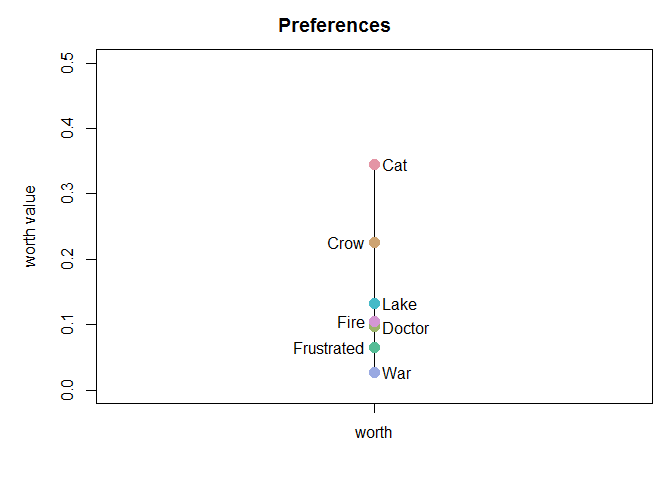

<!-- README.md is generated from README.Rmd. Please edit that file -->

# tiefightR 

# tiefightR

<!-- badges: start -->

<!-- badges: end -->

The goal of tiefightR is to rank commodity positions obtained from
preference test experiments.

**Preference tests** are a straightforward approach in asking the
appraisal of different goods. To gain a better understanding of the
valence of choices made, however, there is a demand for sophisticated
tests which allow estimating the strength of the respective preferences.
The number of commodities presented at the same time is, however,
limited and in classical test settings, usually only two options are
presented. Here, we evaluate the option of combining multiple binary
choices to rank preferences among a larger number of commodities. In the
case of continuous data, ties are introduced when the same amount of
commodity (e.g. a fluid) was chosen. The tiefightR package creates a
ranking system that takes into account the number of ties and
intransitivities in the data. This will help the user to rank specific
commodities and evaluate the quality of this ranking. In estimating the
position of an item, tiefightR takes advantage of the “worth value” in
the **prefmod** package with its fit of a Bradley-Terry model.

## Installation

You can install the development version from
[GitHub](https://github.com/) with:

``` r
# install.packages("devtools")
devtools::install_github("mytalbot/tiefightR")
```

… or download the [source
file](https://github.com/mytalbot/tiefightR/tree/master/sourcefiles) for
easy installation from within R (or RStudio) if you don’t have devtools
available.

### Dependencies

**tiefightR** uses the following packages as dependencies (in no
particular order). Installing tiefightR will usually take care of this.
However, sometimes single dependencies can cause problems and have to be
installed manually.

“magrittr”, “tibble”, “dplyr”, “reshape2”, “prefmod”, “gnm”, “ggplot2”,
“ggpubr”, “foreach”, “viridis”, “Rmisc”

The following function can be used to install single packages - or just
the missing ones from CRAN.

``` {r
install.packages("paste missing package name here") 
```

## The Website and Vignette(s)

…can be found [here](https://talbotsr.com/tiefightR/).

## Example

This is a basic example which shows how to compare an item with any
combination of the remaining items.

``` r
library(tiefightR)
raw        <- tiefightR::human
human_test <- tie_worth(xdata     = raw,
                        showplot  = TRUE,
                        compstudy = "LagreValenceRange_SpringSchool",
                        default   = "War",
                        ordn      = c("Cat", "Crow", "Doctor", "Frustrated", "Lake", "War", "Fire"),
                        r1        = "Lake", # change this
                        r2        = "Cat")  # change this / to multiple combis
```


